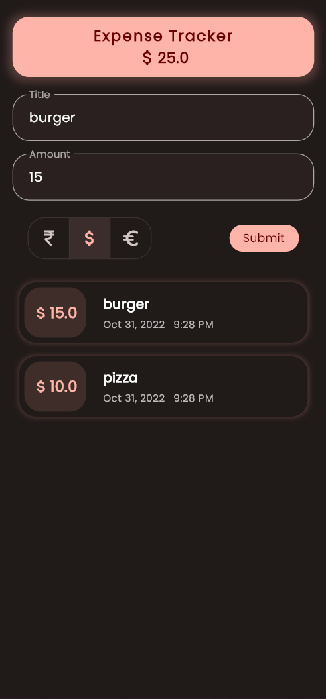

# Expenses Tracker
Flutter app to keeps track of your expenses

## Getting Started

- Clone the repo
    - ssh: `git clone git@github.com:AM-ash-OR-AM-I/user_expenses.git`
    - https: `https://github.com/AM-ash-OR-AM-I/user_expenses.git`
- Make sure install [flutter](https://flutter.dev) sdk first.
- run `flutter doctor` in terminal/cmd to check if everything is setup correctly
- Open the project in your favorite IDE (VSCode, Android Studio, etc)
- Run `flutter pub get` to install all dependencies
- Navigate to `lib` directory and run `main.dart` to launch app for android or windows/linux
- You may need additional adb tools installed in your machine for android or you can use [Wireless debugging](https://medium.com/android-news/wireless-debugging-through-adb-in-android-using-wifi-965f7edd163a) to connect to android device and [scrcpy](https://github.com/Genymobile/scrcpy) for mirroring android

## Release 📦
- Add Internet permission in [AndroidManifest.xml](./android/app/src/main/AndroidManifest.xml) file
- ```xml
  <manifest xmlns:android="http://schemas.android.com/apk/res/android">
    <uses-permission android:name="android.permission.INTERNET"/>
  ```
  - Furthermore, you can add other permissions as well if you want to use them in your app
- Run `flutter build apk` to build apk file or use github actions to build apk for you by creating a release:
    - Add tag name (`git tag -a v1.0.0 -m "First release"`)
    - Push tag (`git push origin v1.0.0 or git push --tags`)
    - Wait for github actions to build apk for you
    - Download apk from `Assets` section of release
    

## Contributing
- Visit [Issues tab](https://github.com/AM-ash-OR-AM-I/user_expenses/issues) to see list of active issues to which you can contribute.
- Make a PR (Pull Request) after you are done with changes.

Would love to see your ideas and contributions to this project!

## Features
* Uses Material v3 monet engine for dynamic wallpaper based color 🎨 palette (For Android 12)

* Auto dark 🌙 mode

## Screenshots

